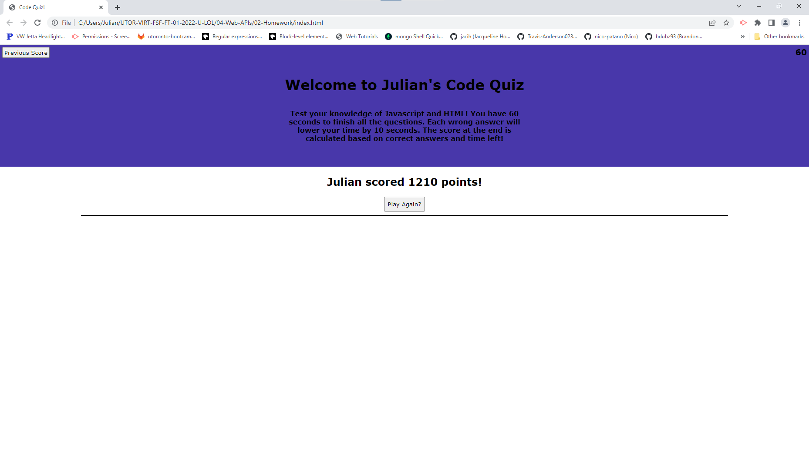

# Code Quiz 

## Description

### What does Code Quiz do?

A timed quiz on HTML and Javascript.


## Table of Contents

- [Installation](#installation)
- [Usage](#usage)
- [Credits](#credits)
- [Contribution](#contribution)
- [Questions](#questions)
- [Licence](#licence)

---

## Installation 

### Technologies Used in Development

Technologies used include:

HTML, CSS and Javascript

### Installation Instructions

```md
none
```

## Usage



```md
Click start and enjoy!
```

## Credits

Me

## Contribution

Guidelines for contribution:

No contribution necessary.

## Questions

No contact please.

https://github.com/jq67


---
## Licence
This project is covered under the `Mit License`